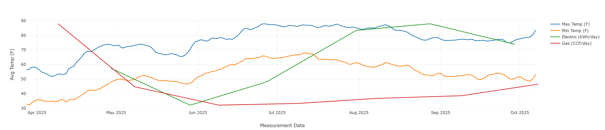

# utility-stats

Simple tool to graph your utility usage against the temperature in your area. The temperature is pulled from multiple
historical weather providers, based on the range of dates present in the input files. Currently,
[VisualCrossing](https://www.visualcrossing.com/) and [OpenWeather](https://openweathermap.org/) are supported as data
providers. Both can be used with free accounts.



## Configuring

The tool requires a `config.json` to be in the project's root directory. The file should have the following format:

```json
{
  "electric_file": "electric.csv",
  "gas_file": "gas.csv",
  "smoothing_days": 14,
  "address": "123 Main Street,Boston,MA,USA",
  "lat": 42.355370,
  "lon": -71.065715,
  "visual_crossing": {
    "api_key": "a_key"
  },
  "open_weather_map": {
    "api_key": "a_key"
  }
}
```

Make sure to enter both your street address as well as the latitude and longitude for your location, since different
weather services use different forms of your location to determine the temperature. Additionally, make sure to put in
your API keys for the various weather providers. Currently, keys for both services are required for the tool to work.

## Usage

You can manually enter your utility usage in a CSV file, specific to the utility to track (ie, gas and electric). The
format for the CSV files is the same:

* date: ISO date of a meter measurement (ie, 2025-10-21)
* measurement: the kWh (electric) or ccf (gas) used since the last meter reading

The CSV file should contain no header row. Make sure the names of the files correspond to the names you specified for
the files (`electric_file` and `gas_file`) in the `config.json`.

You can now run the tool using `cargo run`. It will output a file called `all-utilities.html` that will provide an
interactive graph of your utility usage.

## Cache

In order to help minimize the number of requests made to the weather providers (since they have rate limits on their
API free tiers), all responses retrieved from their APIs are cached in the `cache` folder. When possible, data will be
pulled from the cache instead of making live queries to the weather API.
